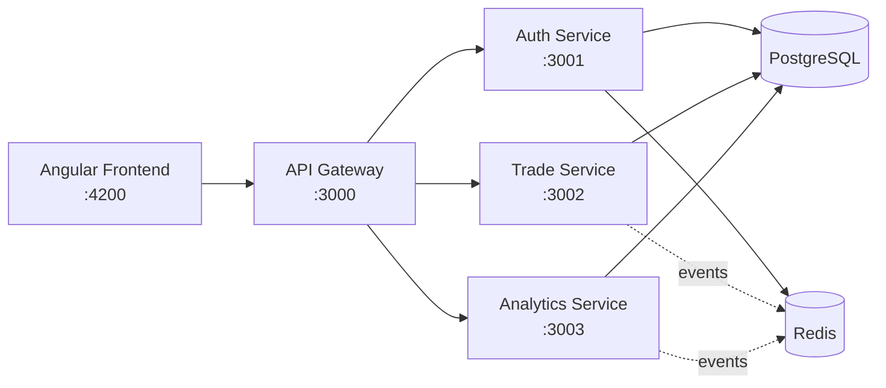

# Trade Journal

A full-stack trading journal application for tracking, analyzing, and improving your trading performance. Built with a microservices architecture using Angular and NestJS.

## Architecture



## Tech Stack

| Layer | Technology |
|-------|-----------|
| Frontend | Angular 19, Angular Material, SheetJS (xlsx) |
| Backend | NestJS, Prisma ORM, TypeScript |
| Database | PostgreSQL 16 |
| Cache/Sessions | Redis 7 |
| Infrastructure | Docker Compose |
| Auth | JWT + Refresh Token rotation |

## Features

- **Authentication** — Signup, login, JWT access tokens with refresh token rotation (7-day sliding session)
- **Trade Management** — Full CRUD for trades with multi-leg support, image attachments
- **Bulk Import** — Import trades from Excel/CSV files with smart column mapping
- **Dashboard** — Overview stats, P&L bar chart (daily/weekly/monthly), cumulative P&L line chart
- **Strategies** — Create and track trading strategies
- **Mistakes** — Log and categorize trading mistakes for review
- **Analytics** — Per-symbol performance breakdown

## Project Structure

```
Trade Journal/
├── auth-service/        # JWT auth, user management, Redis sessions (port 3001)
├── trade-service/       # Trade CRUD, bulk import, strategies, mistakes (port 3002)
├── analytics-service/   # Dashboard stats, P&L aggregation (port 3003)
├── api-gateway/         # Request routing, proxy to services (port 3000)
├── frontend/            # Angular 19 SPA (port 4200)
├── docs/                # HLD, LLD, project plan
└── docker-compose.yml   # PostgreSQL + Redis
```

## Prerequisites

- **Node.js** 18+
- **Docker Desktop** (for PostgreSQL & Redis)
- **npm**

## Getting Started

### 1. Clone and start infrastructure

```bash
git clone https://github.com/Manish-377/trade-journal.git
cd trade-journal
docker-compose up -d
```

### 2. Set up environment files

```bash
cp auth-service/.env.example auth-service/.env
cp trade-service/.env.example trade-service/.env
cp analytics-service/.env.example analytics-service/.env
```

### 3. Install dependencies

```bash
cd auth-service && npm install && cd ..
cd trade-service && npm install && cd ..
cd analytics-service && npm install && cd ..
cd api-gateway && npm install && cd ..
cd frontend && npm install && cd ..
```

### 4. Generate Prisma Client & run migrations

```bash
cd auth-service && npx prisma generate && npx prisma migrate dev && cd ..
cd trade-service && npx prisma generate && npx prisma migrate dev && cd ..
```

### 5. Start all services (each in a separate terminal)

```bash
# Terminal 1 - Auth Service
cd auth-service && npm start

# Terminal 2 - Trade Service
cd trade-service && npm start

# Terminal 3 - Analytics Service
cd analytics-service && npm start

# Terminal 4 - API Gateway
cd api-gateway && npm start

# Terminal 5 - Frontend
cd frontend && npm start
```

### 6. Open the app

```
http://localhost:4200
```

## Environment Variables

Each service uses a `.env` file. Copy the example files to get started:

```bash
cp auth-service/.env.example auth-service/.env
cp trade-service/.env.example trade-service/.env
cp analytics-service/.env.example analytics-service/.env
```

The `.env.example` files contain working defaults for local development. No changes needed.

## API Endpoints

| Method | Endpoint | Description |
|--------|----------|-------------|
| POST | `/api/auth/signup` | Register new user |
| POST | `/api/auth/login` | Login |
| POST | `/api/auth/refresh` | Refresh access token |
| GET | `/api/auth/me` | Get current user profile |
| GET | `/api/trades` | List trades (paginated, filterable) |
| POST | `/api/trades` | Create trade |
| POST | `/api/trades/import` | Bulk import trades |
| PUT | `/api/trades/:id` | Update trade |
| DELETE | `/api/trades/:id` | Delete trade |
| GET | `/api/dashboard/overview` | Dashboard stats |
| GET | `/api/dashboard/daily-pnl` | Daily P&L data |
| GET | `/api/dashboard/symbols` | Per-symbol breakdown |

## Deployment

### Architecture Note

The intended architecture routes all traffic through the **API Gateway** (see diagram above). In production, the gateway handles routing, rate limiting, and provides a single entry point.

However, the current live demo deploys on Railway's free tier which limits resources to 5. Due to this constraint, the demo frontend calls the backend microservices directly (bypassing the gateway). This is a temporary hosting workaround — the codebase fully supports the gateway architecture for local development and paid deployments.

### Live Demo

| Service | URL |
|---------|-----|
| Frontend | Vercel (TBD) |
| Auth Service | Railway |
| Trade Service | Railway |
| Analytics Service | Railway |
| PostgreSQL | Railway |
| Redis | Railway |

## License

MIT
