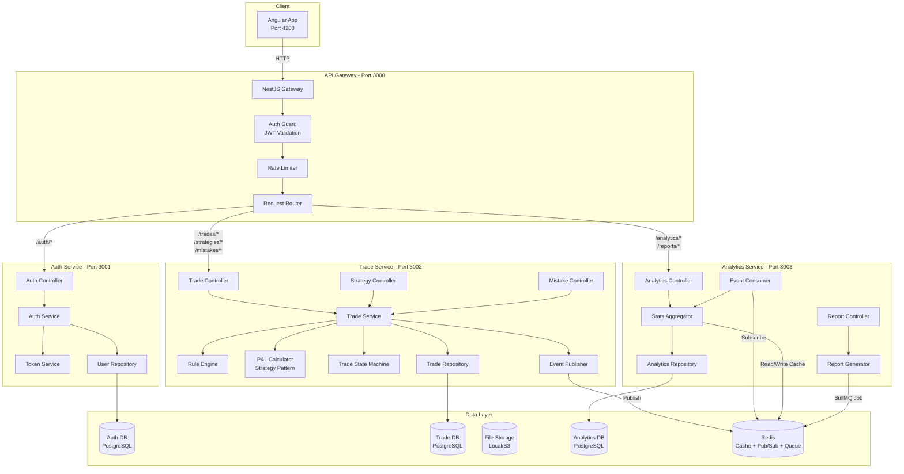
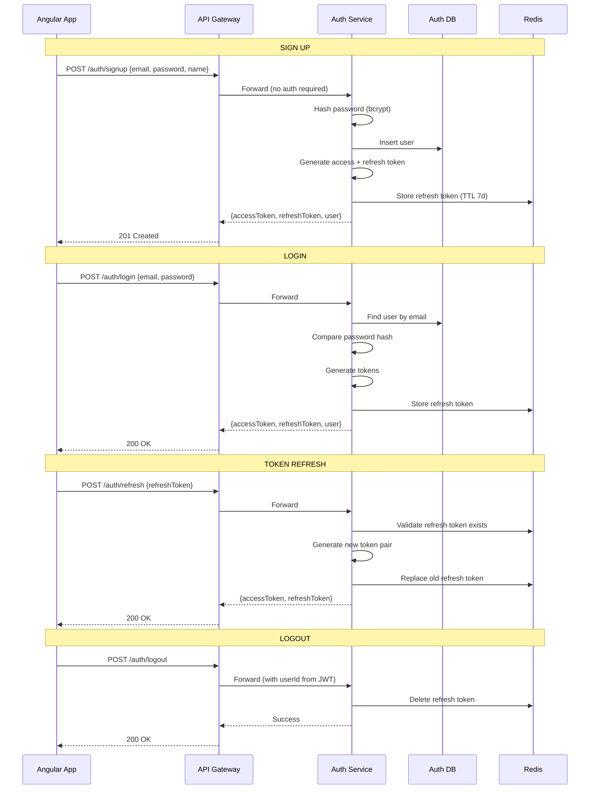
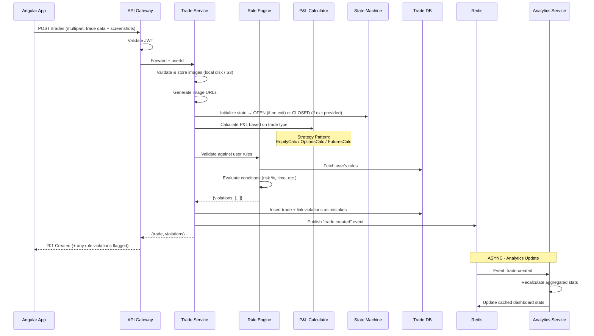
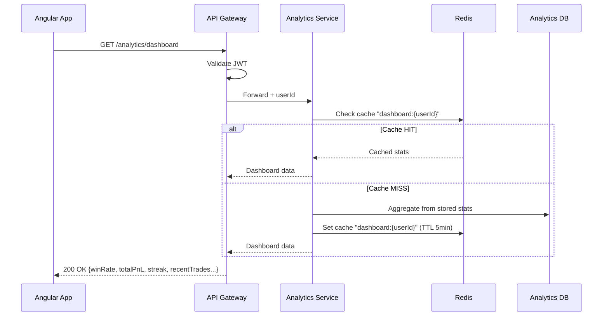
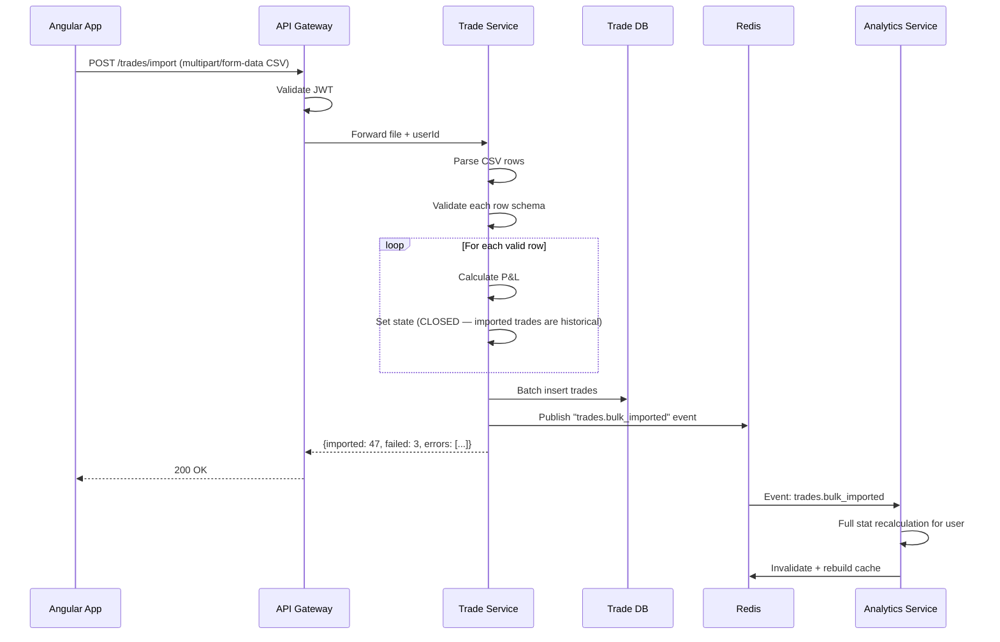
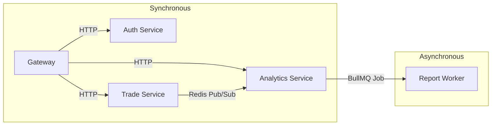
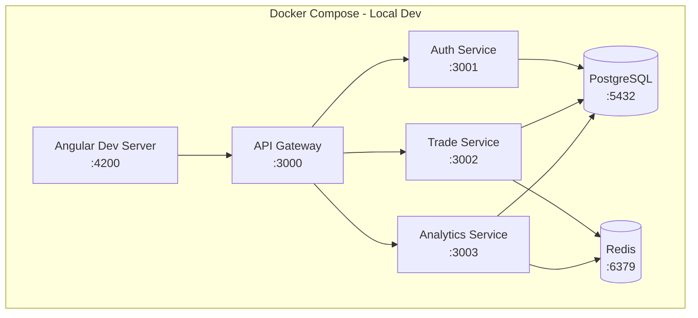

# Trading Journal — High Level Design (HLD)

---

## 1. System Architecture Diagram

---

## 2. Request Flow

### 2.1 Authentication Flow

### 2.2 Trade Creation Flow (Core Flow)

### 2.3 Dashboard Load Flow

### 2.4 CSV Import Flow

---

## 3. API Contracts

### Auth Service APIs

| Method | Endpoint | Body | Response |
|--------|----------|------|----------|
| POST | `/auth/signup` | `{email, password, name}` | `{accessToken, refreshToken, user}` |
| POST | `/auth/login` | `{email, password}` | `{accessToken, refreshToken, user}` |
| POST | `/auth/refresh` | `{refreshToken}` | `{accessToken, refreshToken}` |
| POST | `/auth/logout` | — | `{message}` |
| GET | `/auth/me` | — | `{user}` |

### Trade Service APIs

| Method | Endpoint | Body/Params | Response |
|--------|----------|-------------|----------|
| POST | `/trades` | `multipart: {symbol, type, direction, entryPrice, exitPrice, quantity, strategyId, notes, tags, screenshots[]}` | `{trade, violations}` |
| POST | `/trades/:id/screenshots` | `multipart: screenshots[] (PNG/JPG/JPEG/WebP, max 5MB each, max 5 per trade)` | `{imageUrls[]}` |
| DELETE | `/trades/:id/screenshots/:imageId` | — | `{message}` |
| GET | `/trades` | `?page, limit, status, strategy, dateFrom, dateTo, symbol` | `{trades[], total, page}` |
| GET | `/trades/:id` | — | `{trade}` |
| PATCH | `/trades/:id` | Partial trade fields | `{trade}` |
| PATCH | `/trades/:id/close` | `{exitPrice, closedAt}` | `{trade}` |
| PATCH | `/trades/:id/review` | `{notes, mistakeIds}` | `{trade}` |
| DELETE | `/trades/:id` | — | `{message}` |
| POST | `/trades/import` | CSV file (multipart) | `{imported, failed, errors}` |
| | | | |
| POST | `/strategies` | `{name, description, rules}` | `{strategy}` |
| GET | `/strategies` | — | `{strategies[]}` |
| PATCH | `/strategies/:id` | Partial fields | `{strategy}` |
| DELETE | `/strategies/:id` | — | `{message}` |
| | | | |
| POST | `/mistakes` | `{name, category, description}` | `{mistake}` |
| GET | `/mistakes` | — | `{mistakes[]}` |
| PATCH | `/mistakes/:id` | Partial fields | `{mistake}` |
| DELETE | `/mistakes/:id` | — | `{message}` |
| | | | |
| POST | `/rules` | `{name, conditionType, operator, value, action}` | `{rule}` |
| GET | `/rules` | — | `{rules[]}` |
| DELETE | `/rules/:id` | — | `{message}` |

### Analytics Service APIs

| Method | Endpoint | Params | Response |
|--------|----------|--------|----------|
| GET | `/analytics/dashboard` | — | `{totalPnL, winRate, avgRR, currentStreak, totalTrades, recentTrades[]}` |
| GET | `/analytics/performance` | `?period=daily/weekly/monthly&from&to` | `{dataPoints[{date, pnl, cumulative}]}` |
| GET | `/analytics/strategies` | — | `{strategies[{name, winRate, avgPnL, tradeCount}]}` |
| GET | `/analytics/mistakes` | — | `{mistakes[{category, count, totalLoss}]}` |
| GET | `/analytics/patterns` | — | `{byDayOfWeek[], byHour[], byHoldTime[]}` |
| POST | `/reports/generate` | `{type: weekly/monthly, dateRange}` | `{jobId}` |
| GET | `/reports/:jobId/status` | — | `{status, downloadUrl}` |
| GET | `/reports` | — | `{reports[]}` |

---

## 4. Event Contracts (Redis Pub/Sub)

| Event | Published By | Consumed By | Payload |
|-------|-------------|-------------|---------|
| `trade.created` | Trade Service | Analytics Service | `{userId, tradeId, pnl, type, strategyId, closedAt}` |
| `trade.updated` | Trade Service | Analytics Service | `{userId, tradeId, oldPnl, newPnl, strategyId}` |
| `trade.closed` | Trade Service | Analytics Service | `{userId, tradeId, pnl, strategyId, closedAt}` |
| `trade.deleted` | Trade Service | Analytics Service | `{userId, tradeId, pnl, strategyId}` |
| `trades.bulk_imported` | Trade Service | Analytics Service | `{userId, count}` |
| `report.generate` | Analytics Controller | Report Worker (BullMQ) | `{userId, type, dateRange}` |

---

## 5. Caching Strategy

| Cache Key | Data | TTL | Invalidated By |
|-----------|------|-----|----------------|
| `dashboard:{userId}` | Aggregated dashboard stats | 5 min | `trade.created/updated/deleted/closed` |
| `performance:{userId}:{period}` | Performance chart data | 10 min | `trade.*` events |
| `strategies:{userId}` | Strategy list with computed win rates | 10 min | `trade.*` events, strategy CRUD |

**Invalidation approach:** On any `trade.*` event, delete relevant cache keys for that userId. Next read triggers fresh computation and re-caches.

---

## 6. Service Communication Summary

- **Sync (HTTP):** Client-facing requests that need immediate response
- **Async (Events):** Background work that can tolerate 1-2 second delay (stat recalculation, report generation)

---

## 7. Deployment View

Each service has its own database schema (logical separation within same PostgreSQL instance for local dev — separate instances in production).

---

## 8. Non-Functional Requirements

| Aspect | Decision |
|--------|----------|
| Auth | JWT (15min expiry) + refresh token (7 day, stored in Redis) |
| Rate Limiting | 100 requests/minute per user on Gateway |
| Pagination | Cursor-based for trade history, page-based for reports |
| File Upload | Max 5MB CSV; Screenshots: max 5MB per image, max 5 per trade (PNG, JPG, JPEG, WebP) |
| File Storage | Local disk in dev, S3-compatible (MinIO/AWS S3) in prod. Files stored by userId/tradeId path. |
| Error Handling | Standardized error response format across all services |
| Logging | Structured JSON logs with correlation ID across services |
| Health Checks | Each service exposes `/health` endpoint |
