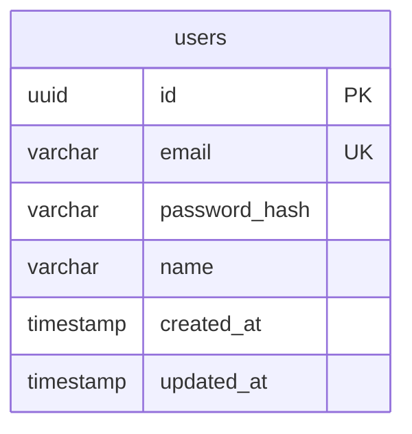
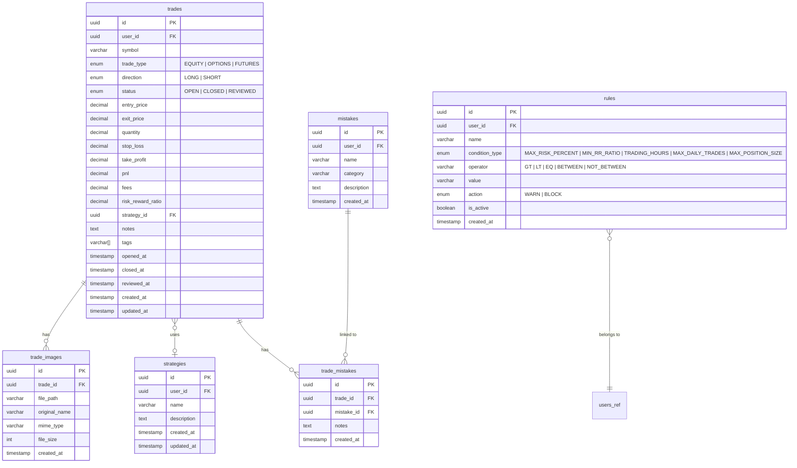
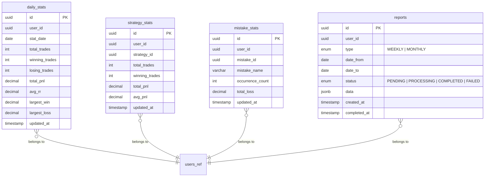
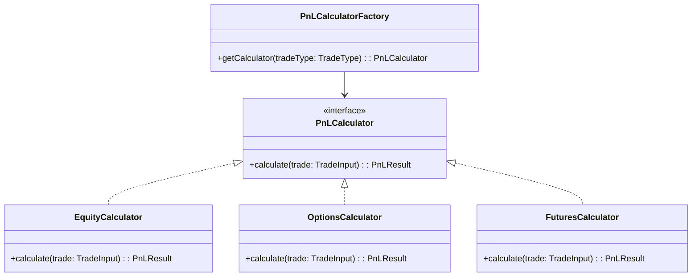
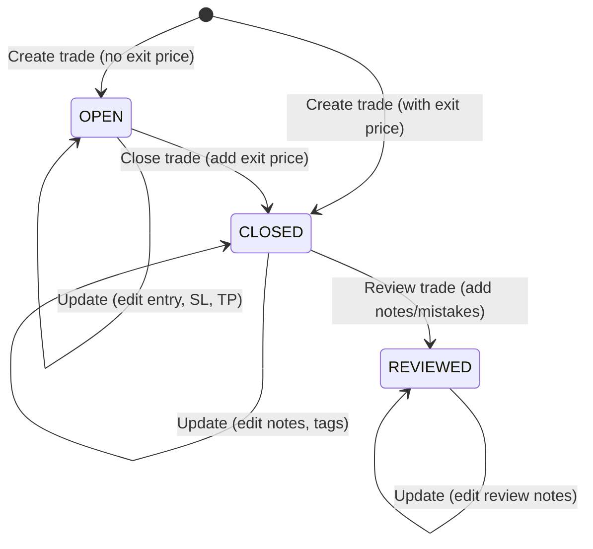
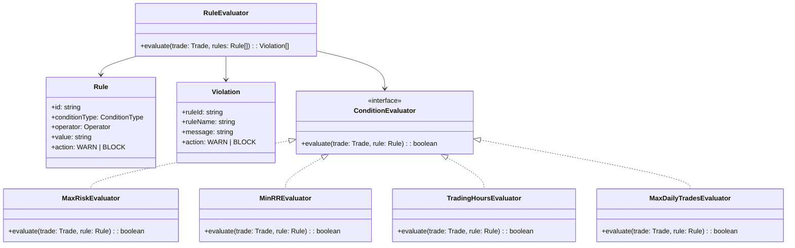
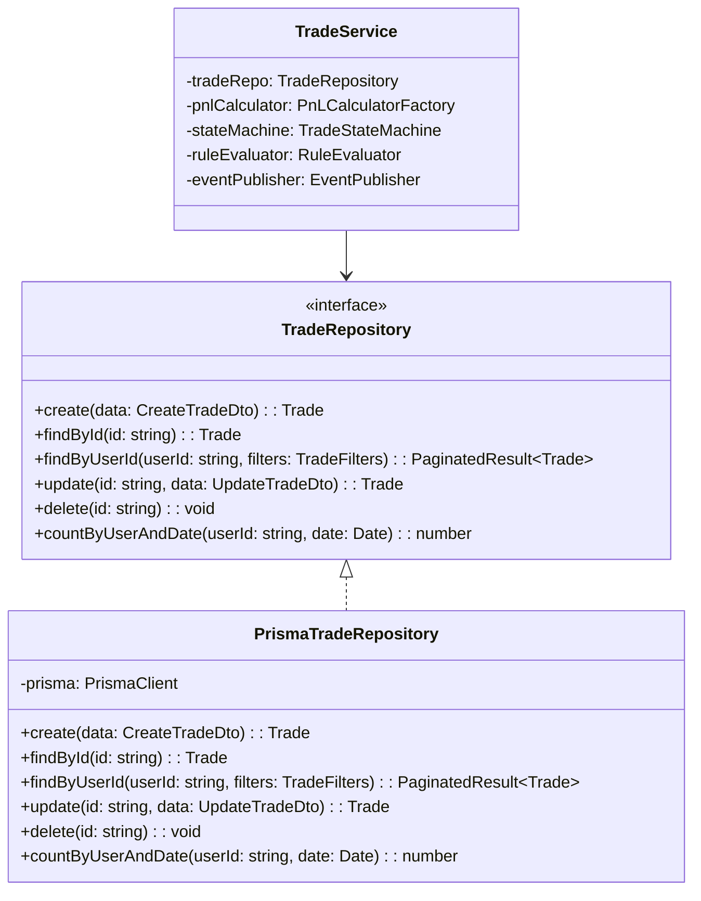
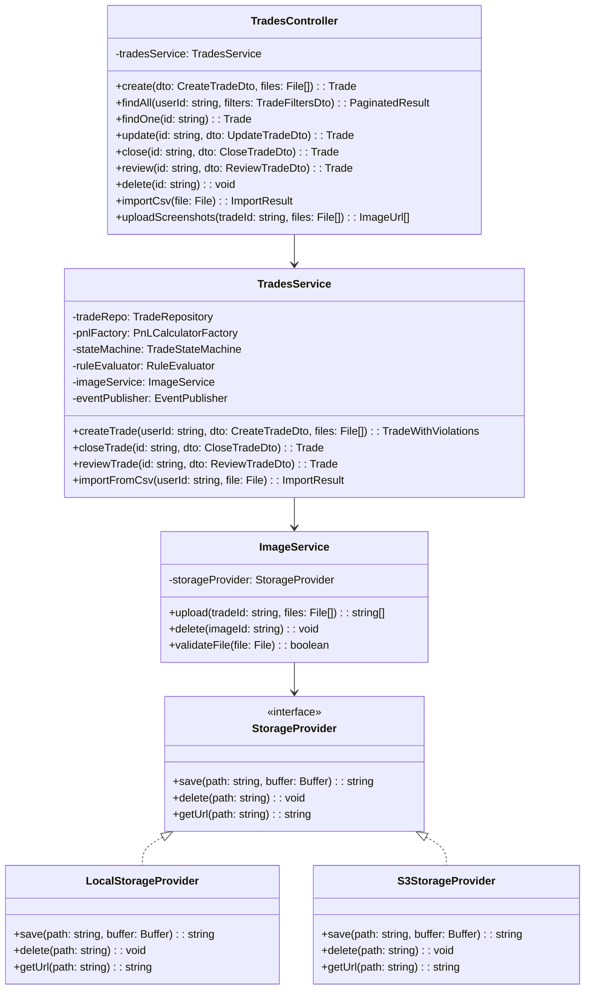
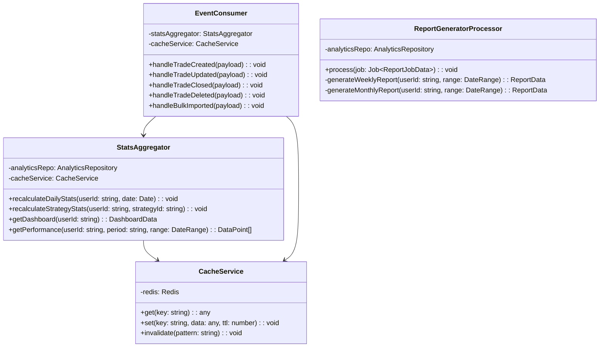

# Trading Journal — Low Level Design (LLD)

---

## 1. Database Schema

### 1.1 Auth Service Database



**Redis Keys (Auth):**
```
refresh_token:{userId}:{tokenId} → {token, expiresAt}   TTL: 7 days
```

---

### 1.2 Trade Service Database



**Indexes:**
```sql
-- trades
CREATE INDEX idx_trades_user_id ON trades(user_id);
CREATE INDEX idx_trades_user_status ON trades(user_id, status);
CREATE INDEX idx_trades_user_opened_at ON trades(user_id, opened_at DESC);
CREATE INDEX idx_trades_user_strategy ON trades(user_id, strategy_id);
CREATE INDEX idx_trades_symbol ON trades(user_id, symbol);

-- trade_images
CREATE INDEX idx_trade_images_trade_id ON trade_images(trade_id);

-- strategies
CREATE INDEX idx_strategies_user_id ON strategies(user_id);

-- trade_mistakes
CREATE INDEX idx_trade_mistakes_trade_id ON trade_mistakes(trade_id);
CREATE INDEX idx_trade_mistakes_mistake_id ON trade_mistakes(mistake_id);
```

---

### 1.3 Analytics Service Database



**Indexes:**
```sql
CREATE UNIQUE INDEX idx_daily_stats_user_date ON daily_stats(user_id, stat_date);
CREATE INDEX idx_daily_stats_date_range ON daily_stats(user_id, stat_date DESC);
CREATE UNIQUE INDEX idx_strategy_stats_user_strategy ON strategy_stats(user_id, strategy_id);
CREATE INDEX idx_reports_user ON reports(user_id, created_at DESC);
```

---

## 2. Design Patterns — Detailed Implementation

### 2.1 Strategy Pattern — P&L Calculator



**Logic:**
```
EquityCalculator:
  LONG:  pnl = (exitPrice - entryPrice) * quantity - fees
  SHORT: pnl = (entryPrice - exitPrice) * quantity - fees

OptionsCalculator:
  LONG:  pnl = (exitPremium - entryPremium) * quantity * lotSize - fees
  SHORT: pnl = (entryPremium - exitPremium) * quantity * lotSize - fees

FuturesCalculator:
  LONG:  pnl = (exitPrice - entryPrice) * quantity * contractMultiplier - fees
  SHORT: pnl = (entryPrice - exitPrice) * quantity * contractMultiplier - fees
```

---

### 2.2 State Machine — Trade Lifecycle



**Transition Rules:**
| Current State | Allowed Actions | Blocked Actions |
|---------------|----------------|-----------------|
| OPEN | update, close, delete | review |
| CLOSED | update, review, delete | close (already closed) |
| REVIEWED | update review, delete | close |

**Implementation:**
```
class TradeStateMachine:
  transitions = {
    OPEN:     [CLOSED],
    CLOSED:   [REVIEWED],
    REVIEWED: []
  }

  canTransition(from, to):
    return to in transitions[from]

  transition(trade, targetState):
    if !canTransition(trade.status, targetState):
      throw InvalidStateTransitionError
    return { ...trade, status: targetState }
```

---

### 2.3 Rule Engine — Trade Validation



**Flow:**
```
1. User creates trade
2. Fetch user's active rules
3. For each rule:
   - Get appropriate ConditionEvaluator
   - Evaluate trade against rule
   - If violated → add to violations list
4. If any violation has action=BLOCK → reject trade creation
5. If violations have action=WARN → save trade + auto-link violations as mistakes
6. Return trade + violations to user
```

---

### 2.4 Repository Pattern



**Why:** Services depend on the interface, not the implementation. Makes unit testing easy (mock the repository), and you could swap Prisma for TypeORM without touching service logic.

---

## 3. Module Structure (NestJS)

### 3.1 Trade Service — Internal Modules

```
trade-service/
├── src/
│   ├── main.ts
│   ├── app.module.ts
│   │
│   ├── trades/
│   │   ├── trades.module.ts
│   │   ├── trades.controller.ts
│   │   ├── trades.service.ts
│   │   ├── trades.repository.ts
│   │   ├── dto/
│   │   │   ├── create-trade.dto.ts
│   │   │   ├── update-trade.dto.ts
│   │   │   └── trade-filters.dto.ts
│   │   ├── entities/
│   │   │   └── trade.entity.ts
│   │   ├── pnl/
│   │   │   ├── pnl-calculator.interface.ts
│   │   │   ├── pnl-calculator.factory.ts
│   │   │   ├── equity.calculator.ts
│   │   │   ├── options.calculator.ts
│   │   │   └── futures.calculator.ts
│   │   ├── state-machine/
│   │   │   └── trade-state-machine.ts
│   │   └── images/
│   │       ├── images.service.ts
│   │       └── images.controller.ts
│   │
│   ├── strategies/
│   │   ├── strategies.module.ts
│   │   ├── strategies.controller.ts
│   │   ├── strategies.service.ts
│   │   └── strategies.repository.ts
│   │
│   ├── mistakes/
│   │   ├── mistakes.module.ts
│   │   ├── mistakes.controller.ts
│   │   ├── mistakes.service.ts
│   │   └── mistakes.repository.ts
│   │
│   ├── rules/
│   │   ├── rules.module.ts
│   │   ├── rules.controller.ts
│   │   ├── rules.service.ts
│   │   ├── rule-evaluator.ts
│   │   └── evaluators/
│   │       ├── condition-evaluator.interface.ts
│   │       ├── max-risk.evaluator.ts
│   │       ├── min-rr.evaluator.ts
│   │       ├── trading-hours.evaluator.ts
│   │       └── max-daily-trades.evaluator.ts
│   │
│   ├── events/
│   │   └── event-publisher.service.ts
│   │
│   └── shared/
│       ├── filters/
│       │   └── http-exception.filter.ts
│       ├── interceptors/
│       │   └── logging.interceptor.ts
│       └── pipes/
│           └── validation.pipe.ts
│
├── prisma/
│   ├── schema.prisma
│   └── migrations/
│
├── test/
│   ├── trades.service.spec.ts
│   ├── pnl-calculator.spec.ts
│   ├── trade-state-machine.spec.ts
│   └── rule-evaluator.spec.ts
│
├── Dockerfile
├── package.json
└── tsconfig.json
```

### 3.2 Auth Service — Internal Modules

```
auth-service/
├── src/
│   ├── main.ts
│   ├── app.module.ts
│   ├── auth/
│   │   ├── auth.module.ts
│   │   ├── auth.controller.ts
│   │   ├── auth.service.ts
│   │   ├── dto/
│   │   │   ├── signup.dto.ts
│   │   │   ├── login.dto.ts
│   │   │   └── refresh-token.dto.ts
│   │   └── guards/
│   │       └── jwt.guard.ts
│   ├── users/
│   │   ├── users.module.ts
│   │   ├── users.service.ts
│   │   └── users.repository.ts
│   ├── tokens/
│   │   ├── tokens.module.ts
│   │   └── tokens.service.ts
│   └── shared/
│       └── ...
├── prisma/
├── Dockerfile
└── package.json
```

### 3.3 Analytics Service — Internal Modules

```
analytics-service/
├── src/
│   ├── main.ts
│   ├── app.module.ts
│   ├── analytics/
│   │   ├── analytics.module.ts
│   │   ├── analytics.controller.ts
│   │   ├── analytics.service.ts
│   │   ├── stats-aggregator.service.ts
│   │   └── analytics.repository.ts
│   ├── reports/
│   │   ├── reports.module.ts
│   │   ├── reports.controller.ts
│   │   ├── reports.service.ts
│   │   └── report-generator.processor.ts  (BullMQ worker)
│   ├── events/
│   │   ├── events.module.ts
│   │   └── event-consumer.service.ts
│   ├── cache/
│   │   ├── cache.module.ts
│   │   └── cache.service.ts
│   └── shared/
│       └── ...
├── prisma/
├── Dockerfile
└── package.json
```

### 3.4 API Gateway

```
api-gateway/
├── src/
│   ├── main.ts
│   ├── app.module.ts
│   ├── proxy/
│   │   └── proxy.module.ts         (routes to services)
│   ├── guards/
│   │   └── auth.guard.ts           (validates JWT, attaches userId)
│   ├── interceptors/
│   │   ├── rate-limiter.interceptor.ts
│   │   └── correlation-id.interceptor.ts
│   └── filters/
│       └── global-exception.filter.ts
├── Dockerfile
└── package.json
```

### 3.5 Angular Frontend

```
frontend/
├── src/
│   ├── app/
│   │   ├── app.component.ts
│   │   ├── app.routes.ts
│   │   │
│   │   ├── core/
│   │   │   ├── guards/
│   │   │   │   └── auth.guard.ts
│   │   │   ├── interceptors/
│   │   │   │   ├── auth.interceptor.ts      (attach JWT)
│   │   │   │   └── error.interceptor.ts     (global error handling)
│   │   │   ├── services/
│   │   │   │   ├── auth.service.ts
│   │   │   │   └── storage.service.ts
│   │   │   └── models/
│   │   │       ├── trade.model.ts
│   │   │       ├── strategy.model.ts
│   │   │       └── user.model.ts
│   │   │
│   │   ├── features/
│   │   │   ├── auth/
│   │   │   │   ├── login/
│   │   │   │   └── signup/
│   │   │   ├── dashboard/
│   │   │   │   └── dashboard.component.ts
│   │   │   ├── trades/
│   │   │   │   ├── trade-list/
│   │   │   │   ├── trade-form/
│   │   │   │   ├── trade-detail/
│   │   │   │   └── trade-import/
│   │   │   ├── strategies/
│   │   │   │   ├── strategy-list/
│   │   │   │   └── strategy-form/
│   │   │   ├── mistakes/
│   │   │   │   ├── mistake-list/
│   │   │   │   └── mistake-form/
│   │   │   ├── analytics/
│   │   │   │   ├── performance-chart/
│   │   │   │   ├── strategy-breakdown/
│   │   │   │   └── patterns/
│   │   │   ├── reports/
│   │   │   │   └── report-list/
│   │   │   └── rules/
│   │   │       ├── rule-list/
│   │   │       └── rule-form/
│   │   │
│   │   └── shared/
│   │       ├── components/
│   │       │   ├── navbar/
│   │       │   ├── sidebar/
│   │       │   ├── pagination/
│   │       │   ├── file-upload/
│   │       │   └── confirmation-dialog/
│   │       └── pipes/
│   │           ├── currency.pipe.ts
│   │           └── pnl-color.pipe.ts
│   │
│   ├── environments/
│   │   ├── environment.ts
│   │   └── environment.prod.ts
│   └── styles/
│       └── global.scss
│
├── angular.json
├── package.json
└── tsconfig.json
```

---

## 4. Key Class Diagrams

### 4.1 Trade Service — Core Classes



### 4.2 Analytics Service — Core Classes



---

## 5. File Upload Flow (Detailed)

```
1. Angular:
   - User selects files in trade form (file-upload component)
   - Validate client-side: type (PNG/JPG/JPEG/WebP), size (<5MB), count (≤5)
   - Send as multipart/form-data with trade data

2. API Gateway:
   - Forward multipart request to Trade Service (no parsing at gateway)

3. Trade Service:
   - Multer middleware parses multipart request
   - ImageService.validateFile() — recheck type, size, dimensions
   - Generate unique filename: {userId}/{tradeId}/{uuid}.{ext}
   - StorageProvider.save() — write to local disk or S3
   - Store file metadata in trade_images table
   - Return image URLs with trade response

4. Serving images:
   - Dev: NestJS serves static files from /uploads directory
   - Prod: S3 pre-signed URLs or CDN
```

---

## 6. Error Handling Strategy

**Standardized Error Response:**
```json
{
  "statusCode": 400,
  "error": "VALIDATION_ERROR",
  "message": "Entry price must be greater than 0",
  "timestamp": "2026-06-14T10:30:00Z",
  "correlationId": "abc-123-def"
}
```

**Error Types:**
| Code | HTTP Status | When |
|------|-------------|------|
| VALIDATION_ERROR | 400 | DTO validation fails |
| INVALID_STATE_TRANSITION | 400 | e.g., trying to review an OPEN trade |
| RULE_VIOLATION_BLOCKED | 400 | Trade violates a BLOCK rule |
| UNAUTHORIZED | 401 | Missing/invalid JWT |
| FORBIDDEN | 403 | Accessing another user's resource |
| NOT_FOUND | 404 | Trade/Strategy/Mistake not found |
| FILE_TOO_LARGE | 413 | Image > 5MB |
| UNSUPPORTED_FILE_TYPE | 415 | Not PNG/JPG/JPEG/WebP |
| RATE_LIMITED | 429 | Too many requests |
| INTERNAL_ERROR | 500 | Unhandled exception |

---

## 7. Authentication — Token Flow Detail

```
Access Token (JWT):
  - Payload: { userId, email, iat, exp }
  - Expiry: 15 minutes
  - Stored: Memory (Angular service) — NOT localStorage
  - Signed with: RS256 or HS256 secret

Refresh Token:
  - Opaque random string (crypto.randomUUID)
  - Expiry: 7 days
  - Stored: Redis (server) + httpOnly cookie (client)
  - Rotation: New refresh token issued on each refresh call, old one invalidated

Token Refresh Logic (Angular Interceptor):
  1. Request fails with 401
  2. Interceptor catches → calls /auth/refresh
  3. If refresh succeeds → retry original request with new token
  4. If refresh fails → redirect to login
  5. Queue concurrent requests while refresh is in-flight (avoid multiple refresh calls)
```

---

## 8. Pagination Strategy

**Trade History — Cursor-based:**
```
GET /trades?limit=20&cursor=2026-06-10T14:30:00Z

Response:
{
  "trades": [...],
  "nextCursor": "2026-06-09T18:00:00Z",  // opened_at of last item
  "hasMore": true
}
```
Why cursor-based: Trade list is time-ordered, avoids offset skipping issues with new inserts.

**Reports — Page-based:**
```
GET /reports?page=1&limit=10

Response:
{
  "reports": [...],
  "total": 24,
  "page": 1,
  "totalPages": 3
}
```
Why page-based: Reports don't change frequently, simpler UX for numbered pages.
